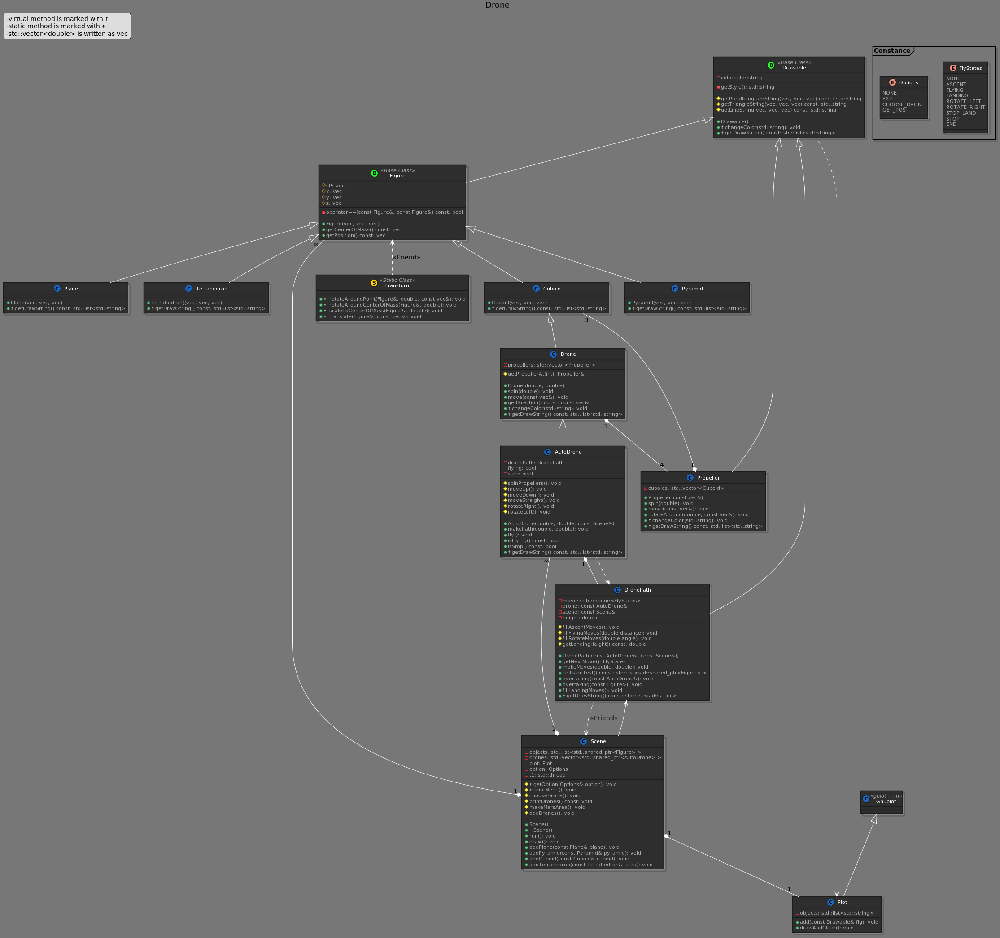

## Rotation

### Building

To build this project:
```
git submodule init
git submodule update
mkdir build && cd build
cmake ..
make
```
This should generate:
* Rotation3D_run - actual program
* Rotation3D_tst - testing program
* doc_doxygen - documentation of code

## Program

Program has been rewritten but works like the previous one

### Extensions

* Every figure you can rotate around Z axis and determine the location (in program)
* Each of figure have unique drawing form, knowing it, you can create various forms of figures
* In program I created nice area there are some figure composed of many different figures

### Transforming

* Every thing transform right, and there are some tests.

### Graph



